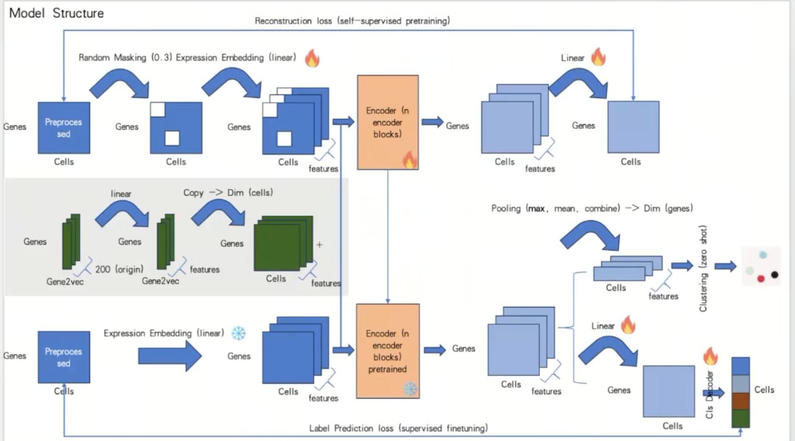

# 关于Embedding：
一共有三路数据输入
1. **基因表达数据**
   * 数据：每个细胞每个基因的表达量，`.h5ad`文件，scRNA-seq
   * 预处理：归一化`sc.pp.normalize_total` $\rightarrow$ Log1p `sc.pp.log1p(adata)` $\rightarrow$ 筛选线粒体基因
   * 获取embedding：通过nn.linear变换得到。（`nn.Linear(genes, seq * feature)`）

2. **基因共表达关系**
   * 数据：基因与基因在统计学上的共表达关系，`.txt`文件 
   * 预处理：根据`1`处理好的adata数据，计算基因间的Pearson相关系数。设定阈值为0.7，得到基因共表达网络(graph) 
   * 获取embedding：根据共表达关系，生成gene短句子（长度为 2 的“短句子” (e.g., ['GeneA', 'GeneB'])），然后使用skip-gram的word2vec获取每一个节点（基因）的embedding。

3. **基因多模态知识**
   * 数据：基因的功能描述、通路信息、蛋白质属性等。`.xlsx`表格
   * 预处理：数值列（都是0或1） $\rightarrow$ 使用线性层进行嵌入。基因的文本描述 $\rightarrow$ 使用预训练的sentence transformer来提取嵌入。
   * 获取embedding：多个不同的embedding进行concat，得到一个特征向量。
  
4. **最终的融合**
   * Gene2Vec原始维度约 200 维。代码进行了 Zero Padding (补零) 扩充到 args.feature_size (比如 512 维)。Extra Info (extra_emb_matrix)：原始维度非常高（文本+OneHot拼接后），代码使用 PCA (主成分分析) 降维到 args.feature_size。
   * 最终的数据：原始数据`x`（scRNA-seq）+ 生物学先验embedding（gene2vec + pca等，作为位置嵌入）

!!! note Pearson相关系数
    总体的协方差除以标准差，衡量两个变量之间的线性相关强度和方向。`r=1`代表完全正线性相关。
    $$r = \frac{\sum_{i=1}^{n} (x_i - \bar{x})(y_i - \bar{y})}{\sqrt{\sum_{i=1}^{n} (x_i - \bar{x})^2} \sqrt{\sum_{i=1}^{n} (y_i - \bar{y})^2}}$$或者$$\rho_{X,Y} = \frac{\text{cov}(X,Y)}{\sigma_X \sigma_Y}$$

!!! note Gene2vec
    * 原文核心思想：将有**共表达的基因对当作上下文**（context），利用Skip-Gram模型做gene embedding。与相同基因有共表达的，实际上也应该比较相近。因此相邻节点 -> 句子上下文。
    * 实现逻辑：语料库就是多个共表达的基因。然后根据共表达关系，生成gene短句子（长度为 2 的“短句子” (e.g., ['GeneA', 'GeneB'])）
    * 为什么**使用gene2vec作为位置向量**，而不是绝对位置向量？绝对位置对基因来说是没有意义的。而是从gene2vec中获取基因嵌入来表示基因的身份(每个基因都有一个唯一的gene2vec嵌入)，这可以看作是相对嵌入，从一般共表达的角度捕捉语义相似性。
    * 为什么**不直接使用相关系数矩阵**？单细胞测序数据非常稀疏（有很多 0），直接计算的相关性可能充满噪声。而且Embedding 能够捕捉高阶关系。即使 Gene A 和 Gene C 没有直接连线，但如果它们都和 Gene B 连线，向量空间中它们也会靠得很近。这补全了潜在的生物学联系。
    * 什么是**Node2Vec**？Node2Vec是把图节点映射为低维稠密向量。与word2vec的唯一区别是序列的生成方式：**从图中通过随机游走生成节点序列**（从起始节点的邻接节点中等概率随机选择一个节点作为下一个节点，直到满足长度要求）。训练阶段完全复用 Word2Vec 的Skip-gram 模型（原因：节点序列通常是短序列，Skip-gram 对小样本 / 短序列的拟合效果更好，且能更好捕捉节点的关联关系），最终将 Skip-gram 的输入层权重作为节点的嵌入向量，和 Word2Vec 提取词向量的逻辑完全一致。

# 关于模型结构

## 1. 输入数据的融合
a. **原始基因表达**：输入`x`是scRNA-seq预处理后的数据，经过`x = x.unsqueeze(-1) x = self.linear_in(x)`，变为： `batch_size, input_dim) -> (batch_size, input_dim, 1) -> (batch_size, input_dim, feature_dim)`
b. **外部生物学知识**：输入`gene_embedding`是`(batch_size, input_dim, feature_dim)`，然后作为位置编码，直接与原始基因表达相加。`x = x + gene_embedding`。这相当于 Transformer 中的 Positional Encoding（位置编码）。在这里，Gene Embedding 告诉模型“我是哪个基因，我有什么功能”。

## 2. Transformer主干
* 包含多个堆叠的标准transformer模块，模型在基因维度上进行自注意力计算。这意味着模型会计算 Gene A 和 Gene B 在当前细胞状态下的关联强度。
* 使用的都是encoder layer，类似bert。因为任务的目标是重建与理解基因表达，而非生成，因此不需要使用decoder。

## 3. 任务输出头
这里有三种不同的工作模式，结构略有不同：

**A. 预训练模式** (Pretraining / scBaseModel)
* 用于自我学习，任务是重建基因表达谱。
* 输出层: self.linear_out = nn.Linear(feature_dim, 1)。
* 流程: Transformer 输出的高维向量被压缩回 1 维标量。
* 目的: 预测该基因原本的表达量（通常结合 Masked 策略，即盖住部分基因让模型去猜，类似于 BERT 的训练方式）。

**B. 分类模式** (Classification / scBaseModel_classification)
* 用于细胞类型注释。
* 冻结策略: 默认情况下，Transformer 主干的参数是冻结的（requires_grad = False），只训练分类头。
* 分类头 (cls_decoder):
  * 这是一个简单的多层感知机（MLP）：Linear -> ReLU -> Dropout -> Linear。
  * 输入: 经过 Transformer 处理后的全基因组表达向量（batch_size, input_dim）。
  * 输出: 细胞类别的概率分布 (batch_size, num_classes)。

**C. 聚类/推断模式** (Cluster / scBaseModel_cluster)
* 用于提取细胞的深层特征表示（Embedding）。
* 特殊之处: 它的 forward 函数设定 return_embedding=True。
* 输出: 它不输出预测值，而是直接返回 Transformer 的输出层特征 (batch_size, input_dim, feature_dim)。这通常用于后续的降维可视化（如 UMAP）或聚类分析。

# 关于预训练。
